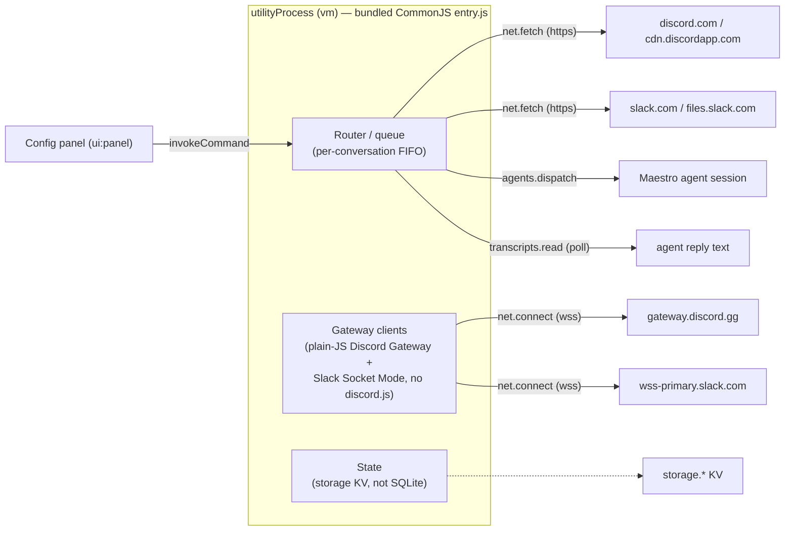

# Maestro-Relay as a Maestro Plugin — Architecture & Feasibility

> **Status:** Decision record for the `rc`-branch effort to ship Maestro-Relay as an
> installable Maestro Plugin. Every constraint below is grounded in the **actual Maestro
> source** (`/home/chris/code/Maestro`, branch `fix/full-access-permission-mode`,
> `HOST_API_VERSION = 1.12.0`), not just the docs — the docs conflict (see §0) and source wins.

## 0. Why source, not docs

`docs/agent-guides/PLUGIN-DEVELOPMENT.md` (verified against host **1.9.0**) says at §13 that
`agents:dispatch` and `process:spawn` "have no production handler; do not build on them yet."
That note is **stale**. `CLAUDE-PLUGINS.md` and the live source at
`src/main/plugins/plugin-host-handlers.ts` + `src/main/index.ts` show all three high-risk verbs
(`agents:dispatch`, `process:spawn`, `net:connect`) are **wired and reachable** on host `1.12.0`,
each behind the full gate stack. All decisions here are pinned to the 1.12.0 source.

## 1. The one hard wall: no npm dependencies inside the sandbox

A tier-1/2 plugin's `entry` file runs as **plain CommonJS inside a `vm` context**
(`src/main/plugins/plugin-sandbox-entry.ts`). Available globals: `maestro` (the frozen brokered
SDK), `module`, `exports`, `console`, `setTimeout`, `clearTimeout`, `Promise`. **Absent by design:**
`require`, `process`, `Buffer`, `globalThis`, all Node builtins; `eval`/`Function` code-gen disabled.

Consequence: **`discord.js`, `@slack/bolt`, `@slack/web-api`, `better-sqlite3`, `botbuilder`,
`grammy`, `restify`, `dotenv` cannot be loaded.** The current Relay kernel is built entirely on
these. A plugin therefore cannot "wrap" or "import" today's code — the gateway/socket protocol
handling, the DB, and the HTTP layers must be **reimplemented against the brokered SDK**.

(The `vm` is documented as realm-escapable, i.e. a hostile plugin *can* reach real `require`.
We do **not** build on that — it is the threat model, not a supported API. Escaping to
`require('discord.js')` would be fragile and against the grain of the system.)

## 2. The tempting-but-dead architecture: "spawn the existing service"

Idea: a thin plugin that `process.spawn`s `node dist/index.js` and lets the real Relay run as a
child. **Dead without Maestro host changes**, per `src/main/plugins/spawn-binary-registry.ts`:

- The `SpawnBinaryRegistry` **ships empty** — "Maestro currently blesses no helper binaries."
- It **rejects `node`, `nodejs`, `bun`, `deno`, `python*`, all shells, `env`, `xargs`** and every
  interpreter by basename. Spawning an interpreter "is arbitrary code execution with extra steps."
- The child's **`env` is host-owned and never inherits `process.env`**, and env keys matching the
  secret heuristic (`token`, `secret`, `apikey`, `auth`, `bearer`, `oauth`, `jwt`, `cert`, …) are
  **rejected at registration**. A bot token can never be delivered as spawn env.
- `cwd` is host-owned. A plugin cannot point the child at `/home/chris/code/maestro-relay`.
- `process.spawn` needs a **trusted** signature + an **allowlist grant naming the exact blessed
  binary name** + a Pianola low/medium-risk verdict + the ActionGuard rate cap.

So a plugin cannot launch the Node service, cannot pass it a token, cannot choose its cwd. This
path only becomes viable if Maestro's `src/main/index.ts` is patched to `register()` a blessed
`maestro-relay` binary — a change in the **other** repo, out of scope for a self-contained plugin.

**Decision: rejected.**

## 3. The chosen architecture: pure in-sandbox tier-2 bridge

Relay becomes a **tier-2 plugin** (code + a config UI panel) that talks to the chat platforms and
to Maestro entirely through the brokered SDK. Everything is host-change-free.

### Transport mapping

| Concern | Today (Node service) | Plugin (brokered SDK) |
| --- | --- | --- |
| Inbound events | discord.js gateway / Bolt Socket Mode / webhook | `maestro.net.connect(wss)` → frames as `net.connect:<id>` events |
| Outbound API | discord.js REST / Slack WebClient | `maestro.net.fetch(url, init)` (host-scoped, redirect: error, 5 MB cap) |
| Route to agent | `maestro-cli` spawn (`src/core/maestro.ts`) | `maestro.agents.dispatch(agentId, prompt)` |
| Agent reply back to chat | CLI returns response text synchronously | **`maestro.transcripts.read` polled after dispatch** (see §5) |
| Persistent state (channel↔agent, threads) | `better-sqlite3` (`src/core/db`) | `maestro.storage.*` KV (strings; JSON-encode) |
| Secrets (bot tokens) | `.env` | `maestro.storage.*` KV, entered via the config panel |
| Non-secret config | `.env` | `maestro.settings.*` under `plugins.sh.maestro.relay.*` |
| Crash resilience | process manager (systemd/launchd) | `maestro.background.register` (`background:service`) |
| Voice transcription | ffmpeg + whisper via `child_process` | **Not available in v1** (see §6) |
| Local HTTP API / CLI push | `POST /api/send` (`src/core/api.ts`) | **Not available** — sandbox cannot listen (see §6) |

## 4. Capabilities the plugin must request

Grounded in `src/shared/plugins/permissions.ts`:

| Capability | Scope kind | Why Relay needs it | Notes / gate |
| --- | --- | --- | --- |
| `net:connect` | host | hold the Discord Gateway / Slack Socket-Mode socket | **high; trusted-only.** ≤4 sockets/plugin, 64 KB/frame. |
| `net:fetch` | host | Discord REST, Slack Web API, attachment download | egress-guarded; no redirects; 5 MB body cap |
| `agents:read` | none | list agents to offer in the binding UI | low |
| `agents:dispatch` | **allowlist** | deliver a chat message to the bound agent | **high;** grant names exact agent ids; **needs unattended consent** |
| `transcripts:read` | path | read the agent's reply to send back to chat | **high; needs trusted key** when held with net egress |
| `storage:read` / `storage:write` | none | tokens + channel↔agent registry + thread map | low; purged on uninstall |
| `settings:read` / `settings:write` | none | non-secret config (`plugins.<id>.*`) | low |
| `events:subscribe` | none | react to `agent.statusChanged` for status reactions | medium; metadata only |
| `notifications:toast` | none | surface start/stop/errors | low |
| `background:service` | none | supervised gateway restart on crash | high |
| `ui:panel` | none | the configuration panel | medium |
| `ui:contribute` | none | optional status item / menu entries | medium |

Explicitly **not** requested: `process:spawn` (needed only for voice; blocked — see §6),
`fs:*` (no direct filesystem need once state lives in KV).

### 4a. The manifest is a per-operator artifact (agents:dispatch allowlist)

`agents:dispatch` has scope kind **`allowlist`** (`CAPABILITY_SCOPE_KIND`), and `parsePermissions`
**rejects an unscoped allowlist request as a wildcard** — the `scope` MUST be a non-empty,
comma-separated list of **exact agent ids** (no `*`, no whitespace, no paths). The consent window
can only mint a grant bounded by that manifest scope, so a placeholder id is functionally useless:
the operator's real agent ids must be present in `plugin.json`.

Implication: **the generic distributable manifest cannot ship a working `agents:dispatch` request.**
The operator's concrete agent ids must be injected into `permissions` and the plugin **re-signed**
**before install** (any manifest edit invalidates the ed25519 signature, and an installed plugin's
sandboxed panel can neither edit `plugin.json` nor hold the signing key). So allowlist injection +
signing is a **pre-install packaging step** (`maestro plugin sign` in the build), not an in-panel
action. The panel's role is only to *read* agents (`agents:read`) and show the operator which agent
ids to bake into the manifest before packaging. A friendlier flow (consent-time allowlist entry)
would be a **Maestro host feature request**, tracked as such.

## 5. The reply-path problem (design-critical)

`agents.dispatch` (`src/main/index.ts` `dispatchPromptToSession`) delivers the prompt to a renderer
session and returns only `{ dispatched: true, sessionId }`. It does **not** return the agent's
answer, and the event bus is **metadata-only** (`session.updated` carries `status`, never text).

Relay's whole point is streaming the agent's reply back into the chat channel. The only sanctioned
way to obtain reply text is **`transcripts:read`** — projected session content
(`fullResponse`, `summary`, `timestamp`, `type`, …). Mechanism:

1. On an inbound chat message, `agents.dispatch(agentId, prompt)` → `{ dispatched, sessionId }`
   (source: `dispatchPromptToSession`, `src/main/index.ts`).
2. Poll `transcripts.read({ sessionId, fields: ['id','type','timestamp','fullResponse','summary'], since })`
   and finish on the `agent.completed` event for that `sessionId` (metadata-only, keyed on the same
   id dispatch returns), an idle-grace fallback, or a hard timeout.
3. `transcripts.read` filters with `timestamp >= since` (**inclusive**), so the boundary row re-appears
   every poll; dedupe by entry `id` and post only new `fullResponse` text to the channel via `net.fetch`.

Constraint chain that makes this legal: `transcripts:read` is **refused for an untrusted plugin
that also holds `net:fetch`/`net:connect`** (the exfiltration combo). Since `net:connect` is
already **trusted-only**, the plugin must be signed with a key in **Maestro's trusted set** anyway
— which simultaneously unlocks `transcripts:read`. See §7.

> [!NOTE]
> **Contract source-verified; live end-to-end still pending.** The reply-path *contract* is now
> pinned to the 1.12.0 source, implemented in `src/plugin/reply.ts`, and unit-tested against a
> faithful fake SDK (dispatch shape, inclusive-`since` dedupe by `id`, and `agent.completed` /
> idle-grace / timeout completion). Grounded facts: `agents.dispatch` returns `{ dispatched, sessionId }`;
> `transcripts.read` projects `TRANSCRIPT_PROJECTABLE_FIELDS` filtered by `timestamp >= since`;
> `agent.completed` carries `sessionId` + `status` (no reply text).
> Still unproven on a **live** install (needs the signed/trusted plugin running against a real agent
> session): (a) whether `transcripts.read`'s **project-path grant** is satisfiable for a session the
> plugin did not create (the handler re-checks the session's real `projectPath`); (b) real-world
> completion timing/latency. This remains the top project risk; if the project-path grant fails, the
> fallback is a Maestro host change (a reply event or a dispatch-with-result RPC).

## 6. What is impossible in v1 (and why)

- **Voice transcription** (`src/core/transcription.ts`, `providers/*/voice.ts`). Needs `ffmpeg`
  and `whisper-cli` via `child_process`. In-sandbox that means `process:spawn`, but the
  `SpawnBinaryRegistry` ships empty and env can't carry paths/secrets; blessing those binaries is a
  Maestro-host change. **Marked impossible for v1**; degrade gracefully (attach a "voice not
  supported" note).
- **Local HTTP API / CLI push** (`src/core/api.ts`, `src/cli/`, `POST /api/send`,
  `GET /api/health`). The sandbox is **egress-only**; it cannot `listen()` for inbound connections,
  and the panel webview cancels all non-panel requests. External `maestro-relay send/notify` cannot
  reach the plugin. **Removed in the plugin build**; proactive posting is driven from inside the
  plugin (cue triggers / panel actions) instead.
- **Slack HTTP / Events-API mode** (Bolt `ExpressReceiver`). Same reason — no inbound listener.
  **Socket Mode is the only viable Slack transport** in the plugin.
- **Teams** — see the matrix.

## 7. Deployment prerequisites (must be documented for the user)

1. **Enable the `plugins` Encore feature** in Maestro (off by default).
2. **Trust the signing key.** `net:connect` is trusted-only and `transcripts:read`+egress requires
   trust. The Relay plugin must be **signed** (`maestro plugin sign`) and its public key added to
   Maestro's **trusted set**. Without trust the gateway socket is refused and the plugin cannot run.
3. **Grant + consent on enable:** approve the requested capabilities, add each target agent id to
   the `agents:dispatch` allowlist, and approve the **unattended** dispatch consent (socket-driven
   dispatch is never user-present).
4. **Enter tokens** in the config panel (stored in the plugin's private KV, never in settings).

## 8. Behavioral deltas from today

- **agents:dispatch is allowlist-scoped.** Relay's "bind/switch to *any* agent from chat" narrows
  to the pre-approved allowlist; the config panel offers only granted agents. Switching to an
  unlisted agent prompts the user to widen the grant.
- **No synchronous reply.** Replies arrive via the poll/subscribe loop in §5, so latency and
  ordering differ slightly from the CLI's synchronous return.
- **Rooms (multi-agent).** Real-bot rooms need one gateway socket per persona; the **4-socket cap**
  means ≤3 personas + primary. Masked-persona mode (single socket, `**Handle:**` prefix) is the
  recommended room mode inside the plugin.

## 9. Build shape

- Plugin source in TypeScript under `src/plugin/`, bundled by **esbuild** to a single sandbox-safe
  CommonJS `plugin/entry.js` (no `require`, no Node builtins at runtime — only `maestro`, `console`,
  `setTimeout`, `JSON`).
- `plugin/plugin.json` (manifest), `plugin/panel.html` (config UI), `plugin/README.md`.
- `maestro plugin validate` / `sign` / `pack` for the distributable `.tgz`.

## 10. Provider matrix

See [[maestro-plugin-provider-matrix]] for the full table. Summary: **Discord ✅**, **Slack ✅
(Socket Mode only)**, **Telegram ✅ (long-poll; not in v1 scope)**, **Teams ❌ (needs a public
inbound webhook the sandbox cannot host)**.

## 11. Iteration roadmap

1. ✅ Ground-truth the plugin system; decide the architecture (this doc); scaffold manifest.
2. ✅ Build system: `src/plugin/` + esbuild → sandbox-verified `entry.js`; typed SDK surface
   (`sdk.ts`); dispatch→reply loop (`reply.ts`); storage-backed channel↔agent registry + config
   (`registry.ts`); lifecycle, commands, and message router (`entry.ts`). Unit + bare-`vm`
   sandbox-load tests (`src/__tests__/plugin-*.test.ts`).
3. Config panel (`panel.html`): enter tokens, toggle providers, bind channels to agents. (The
   `storage` KV registry + config reader landed in step 2.)
4. ✅ Discord: plain-JS Gateway client (`src/plugin/providers/discord.ts`) over `net.connect`
   — HELLO→IDENTIFY/RESUME, recursive-`setTimeout` heartbeat with zombie detection,
   `MESSAGE_CREATE` normalization (bot/self skip, guild + allowed-user filters) → `routeInbound`,
   and a `net.fetch` REST reply sink that reuses `splitMessage` for the 2000-char cap. Registered
   in `activate()` behind an enabled-provider + KV-token gate; a `ProviderClient` registry makes
   `status()` report real connection state. 8 unit tests drive the protocol over a fake socket.
5. Slack: `apps.connections.open` → Socket Mode over `net.connect`; Web API over `net.fetch`.
6. Resilience (`background:service`), status (`events`, `notifications`), rooms (masked mode).
7. Sign, validate, pack; end-to-end install + configure + run in Maestro.
