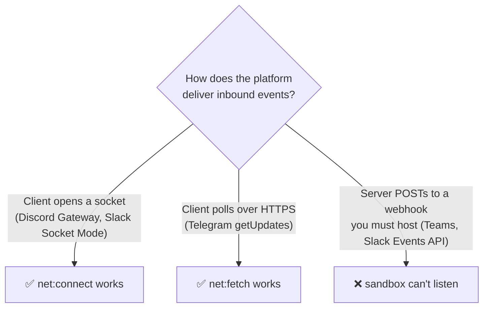

# Maestro-Relay Plugin — Provider Feasibility Matrix

Verdict for each chat provider as a **pure in-sandbox Maestro plugin** (no Maestro host changes).
The deciding factor is the **inbound transport model**: the plugin sandbox is **egress-only** — it
can open outbound `wss://` (`net:connect`) and `https://` (`net:fetch`) connections, but it can
**never listen** for inbound connections. Providers that push events to a webhook you must host are
impossible; providers whose client opens the connection are possible. See
[[maestro-plugin-architecture]] for the full architecture.

| Provider | v1 verdict | Inbound transport | Outbound API | Blocking reason (if any) |
| --- | --- | --- | --- | --- |
| **Discord** | ✅ **POSSIBLE** (v1 target) | Gateway `wss://gateway.discord.gg` via `net:connect` — client-initiated, outbound | REST `https://discord.com`, `https://cdn.discordapp.com` via `net:fetch` | None for text. Voice transcription unavailable (§ below). |
| **Slack** | ✅ **POSSIBLE — Socket Mode only** (v1 target) | Socket Mode `wss://wss-*.slack.com` via `net:connect`; URL obtained from `apps.connections.open` over `net:fetch` | Web API `https://slack.com/api/*`, `https://files.slack.com` via `net:fetch` | HTTP/Events-API mode (Bolt `ExpressReceiver`) is **impossible** — it needs a public inbound webhook. Requires a Socket-Mode app-level token (`xapp-…`). |
| **Telegram** | ✅ **POSSIBLE — long-polling** (not in v1 scope) | `getUpdates` long-poll over `https://api.telegram.org` via `net:fetch` — pure outbound, no socket even needed | same host via `net:fetch` | None. Webhook mode would be impossible, but long-poll sidesteps it entirely. Deferred: v1 ships Discord + Slack. |
| **Teams** | ❌ **IMPOSSIBLE** (as a pure plugin) | Bot Framework: Azure Bot Service **POSTs activities to a public HTTPS endpoint you host** (`/api/messages`) | Bot Connector REST via `net:fetch` (this half works) | The inbound half needs a **publicly reachable HTTP server**. The sandbox cannot `listen()`, and the panel webview cancels all non-panel requests. **No inbound path exists** without an external relay/tunnel or a Maestro host-side receiver. Proactive/outbound-only would work, but that is not "the bot as before." |

## Why the transport model decides everything

## Voice transcription (all providers)

Voice note → text needs `ffmpeg` + `whisper-cli` spawned as child processes. In-sandbox that is
`process:spawn`, gated by Maestro's **host-owned `SpawnBinaryRegistry`**, which ships empty and
refuses to bless interpreters; env cannot carry paths/tokens. **Voice is unavailable in v1** for
every provider until Maestro blesses those binaries (a host change). Text messaging is unaffected.

## Summary

- **v1 ships:** Discord + Slack (Socket Mode). Both use client-initiated outbound connections that
  the sandbox fully supports.
- **Feasible later:** Telegram (long-poll) — no new host capability required.
- **Blocked:** Teams (needs an inbound public webhook) and any Slack HTTP/Events-API deployment;
  voice transcription everywhere (needs `process:spawn` of blessed `ffmpeg`/`whisper`).
